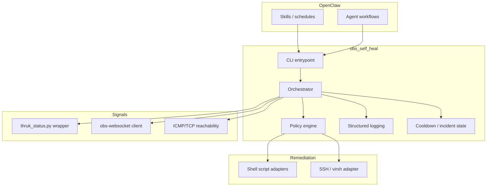

# Self-Healing OBS — Architecture (OpenClaw-centered)

## Mission (operational)

Treat **OpenClaw** as the workflow engine and decision surface: this repository provides **typed health signals**, **policy**, **remediation adapters**, and **audit logs**. Scheduled checks, human approvals, and higher-level runbooks live in OpenClaw (skills, agents, hooks)—not duplicated here as a second orchestrator.

## System context

| Layer | Role |
| --- | --- |
| OpenClaw (WSL2) | Schedules runs, holds credentials paths, surfaces incidents, optional human-in-the-loop |
| This package (`obs_self_heal`) | Signal collection, classification, remediation ladder, verification, structured logs |
| Thruk / `thruk_status.py` | External/public truth about monitoring state (aggregate keyword signals from tactical view) |
| OBS (Windows VM) | Encoder; controlled primarily via **obs-websocket** |
| unRAID / KVM | Host for VM-level recovery via **SSH + virsh** (high impact, isolated) |

OBS is **remote** from WSL2; all probes and websocket traffic are network operations.

## Component diagram

## Data flow (one evaluation cycle)

1. Load config (thresholds, paths, cooldowns, maintenance flag).
2. Collect signals: public (Thruk), OBS websocket, optional reachability, VM/SSH probes.
3. `classify_incident()` → `IncidentClass` + evidence payload.
4. `choose_remediation()` → ordered action with rationale (respecting cooldowns, max actions, dry-run).
5. `execute_remediation()` → invokes adapters (scripts / OBS / SSH) — **never** embeds host-specific shell in policy code; only calls named adapter methods.
6. `verify_recovery()` → re-query signals after configured wait; compare before/after.

## Safety model

- **Cooldowns** per action type (persistent file under configurable `state_dir`).
- **Max actions per incident** (single run window).
- **Maintenance mode**: classify and log only; no mutating remediations.
- **Dry-run**: policy and logging without side effects.
- **Dangerous operations** (`virsh` destroy/reboot) live only in `wrappers/unraid.py` with explicit methods and audit lines.

## Repository layout

See repository tree in the main deliverable README section; code lives under `src/obs_self_heal/`, configuration templates under `configs/`, OpenClaw-facing notes under `skills/`.

## Assumptions and open questions

| Assumption | Notes |
| --- | --- |
| `thruk_status.py` provides aggregate tactical signals | Mayapur TV Hillsborough-specific parsing may require extending the script or adding a dedicated Thruk URL filter; MVP uses keyword counts + thresholds. |
| Script paths point to environment-specific wrappers | Some scripts may need to run on Windows VM or unRAID host; paths are configurable. |
| `obs-cli` / docker invocations in existing scripts are valid for your shell | Package does not rewrite operational knowledge encoded in those scripts. |

| Open question | Suggested follow-up |
| --- | --- |
| Single source of truth for “stream down” | Add JSON output mode to `thruk_status.py` or query a specific service check by name. |
| Windows-side hooks | Reserve interface; implement after stable SSH or WinRM strategy. |
| Rate limits on Thruk | Add minimum interval between Thruk logins in config. |
